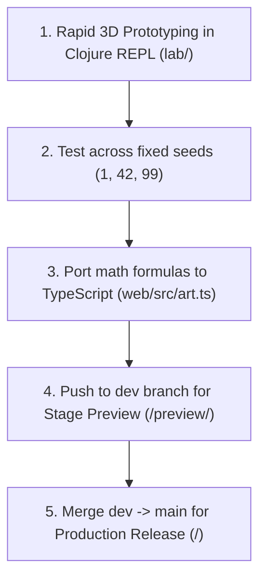

# Virtual Museum 🏛️🎨

A web-based 3D virtual museum displaying deterministic generative art pieces. Built with TypeScript, Three.js, Vite, and Clojure with Quil (Processing).

---

## 🚀 Live & Local URLs

### Live GitHub Pages Deployments
- **Production (`main` branch)**: [https://mugglebornpadawan.github.io/chittu-demo/](https://mugglebornpadawan.github.io/chittu-demo/)
- **Stage Preview (`dev` branch)**: [https://mugglebornpadawan.github.io/chittu-demo/preview/](https://mugglebornpadawan.github.io/chittu-demo/preview/)

### Local Development Server
- **Active Dev Server**: `http://localhost:5173/` *(Run `npm run dev` in `web/`)*

> [!NOTE]
> **Do you need multiple servers running?**
> **No!** You only need to run **`npm run dev`** (Port 5173) for all local development and live-reloading. The production preview commands (`npm run preview` on port 4173) are optional commands used only to inspect compiled build artifacts locally before deploying.

---

## ✨ Features

- **3D Generative Art**: Fresh procedural art generated for each visit, driven by deterministic random seeds.
- **Quil (Processing) REPL Lab**: Interactive 3D art design environment using Clojure + Quil (Processing P3D) for rapid REPL prototyping before shipping to web.
- **Fixed Room Tour**: Smooth navigation across gallery rooms with lazy loading (loads maximum 3 active rooms at a time: `current - 1`, `current`, `current + 1`).
- **Canonical RNG Engine**: Bitwise-identical `mulberry32` PRNG implementation shared across the Clojure REPL lab and the TypeScript web client.
- **Accessible UI**: Keyboard arrow navigation, touch swipe support, minimum $44 \times 44\text{px}$ tap targets, visible focus rings, and proper ARIA tab roles (`role="tablist"`, `role="tab"`).
- **Motion Safety**: Respects `prefers-reduced-motion` with an interactive motion toggle (ON/OFF).
- **WebGL Fallback**: Gracefully detects WebGL availability and displays a fallback preview if WebGL is unsupported.
- **Shareable Tours**: Expresses full tour state via clean URL query parameters (`?tour=12,42,77&v=1&room=0`).

---

## 🎨 Generative Artist Workflow



1. **Rapid 3D Exploration (`lab/`)**:
   - Run `clj -M -m art 42` inside `lab/` or evaluate functions in your Clojure REPL.
   - Modify generative math in `lab/src/art.clj` (`generate-static-params`, rotational speeds, scale ranges, twist constants) with instant live visual feedback in the Quil P3D desktop window.
2. **Seed Variety Verification**:
   - Test your rules against fixed seeds `1`, `42`, `99` (`clj -M -m art 1`, `clj -M -m art 42`, `clj -M -m art 99`) to ensure mathematical rules generate cohesive yet distinct sculptures.
3. **Port Math to TypeScript (`web/src/art.ts`)**:
   - Port your updated generator logic into `generateStaticParams` in `web/src/art.ts`.
   - Update `vectors.json` test vectors to maintain 100% test parity across Clojure and TypeScript.
4. **Stage Preview (`dev` branch)**:
   - Push your branch to `dev` (`git checkout dev && git merge main && git push origin dev`).
   - Open `https://mugglebornpadawan.github.io/chittu-demo/preview/` on your phone or desktop to test the full virtual museum experience.
5. **Production Release (`main` branch)**:
   - Merge `dev` into `main` (`git checkout main && git merge dev && git push origin main`) to launch your updated exhibition to `https://mugglebornpadawan.github.io/chittu-demo/`.

---

## 🛠️ Tech Stack & Architecture

- **Web Frontend**: TypeScript + Three.js (core only, zero addons) + Vite.
- **Generative Lab**: Clojure CLI + Quil (Processing P3D) for 3D REPL art experimentation.
- **RNG**: 32-bit `mulberry32` canonical PRNG algorithm. Seed creation via Web `crypto.getRandomValues()`.
- **CI/CD**: GitHub Actions deploying `main` $\to$ `/` and `dev` $\to$ `/preview/` with automated dist JS budget assertion ($< 5\text{MB}$).

---

## 📁 Repository Structure

```text
├── LICENSE                   # GNU General Public License v3.0 (GPLv3)
├── web/                      # Frontend TypeScript web application
│   ├── src/
│   │   ├── art.ts            # Seed -> staticParams generator & frame transforms
│   │   ├── museum.ts         # Three.js gallery scene & 3-room window manager
│   │   ├── rng.ts            # Mulberry32 canonical PRNG & crypto seed generator
│   │   ├── ui.ts             # Accessible UI navigation overlay & touch/keyboard handlers
│   │   ├── url.ts            # Query parameter state parser & generator
│   │   ├── config.ts         # Museum tour configuration constants
│   │   └── main.ts           # Application entry point & WebGL fallback initialization
│   ├── test/                 # Vitest / Node test runner specifications & vectors.json
│   └── index.html            # Vite HTML entry point
│
├── lab/                      # Clojure REPL art lab (Quil Processing)
│   ├── src/art.clj           # Bitwise-identical Clojure mulberry32, staticParams & Quil P3D sketch
│   ├── test/art_test.clj     # Clojure unit tests asserting vector parity
│   └── deps.edn              # Clojure CLI dependencies (Quil 4.3)
│
├── docs/                     # Design specs & implementation plans
│   ├── superpowers/specs/    # Approved design specifications
│   └── superpowers/plans/    # Detailed phase-by-phase implementation plan
│
└── .github/workflows/        # GitHub Actions workflow for Pages deployment
    └── pages.yml             # Dual branch deployment (main -> /, dev -> /preview/)
```

---

## 💻 Local Machine Setup & Build Guidelines

### 1. Prerequisites

Ensure your local development environment has the following tools installed:

- **Node.js**: `v18.0.0` or higher (`v20+` / `v24+` recommended)
- **npm**: `v9.0.0` or higher
- **Java JDK**: `v11` or higher (required for Clojure CLI)
- **Clojure CLI (`clj`)**: `v1.11+`

Verify installations:
```bash
node -v
npm -v
java -version
clj -v
```

---

### 2. Web Client Build & Execution (`web/`)

#### Step A: Install Dependencies
```bash
cd web
npm install
```

#### Step B: Run Development Server (Main Dev Command)
```bash
npm run dev
```
Open `http://localhost:5173/` in your browser. This is the **only server you need** while developing!

#### Step C: Run Web Unit Test Suite
```bash
npm test
```

#### Step D: Build Production Distribution
```bash
npm run build
```
Compiles TypeScript and bundles production assets into `../dist-main/`.

#### Step E (Optional): Inspect Production & Stage Builds Locally
- **Inspect Production Bundle (`/` base)**:
  ```bash
  npm run preview
  ```
  Opens compiled production build at `http://localhost:4173/`.

- **Inspect Stage Bundle (`/preview/` base)**:
  ```bash
  npx vite build --base=/preview/ --outDir=../dist-preview
  npx vite preview --outDir=../dist-preview
  ```
  Opens compiled stage build at `http://localhost:4173/preview/`.

---

### 3. Generative Lab Build & Execution (`lab/`)

#### Launch 3D Quil (Processing) Sketch from Terminal:
```bash
cd lab

# Launch interactive 3D Quil window for seed 42
clj -M -m art 42

# Launch interactive 3D Quil window for seed 99
clj -M -m art 99
```

#### Launch from Clojure REPL:
```clojure
(require '[art :as art])

;; Launch interactive 3D Quil window for any seed integer
(art/run-lab-sketch 42)
```

#### Run Clojure Parity Unit Tests:
```bash
cd lab
clj -M -e "(require '[clojure.test :refer [run-tests]]) (require 'art-test) (run-tests 'art-test)"
```

---

## 🔒 Determinism & Parity Tests

The lab (Clojure) and web client (TypeScript) share identical floating-point output vectors for test seeds `1`, `42`, and `99`. Test vectors are frozen in `vectors.json` and validated on every build.

---

## 📄 License

Distributed under the **GNU General Public License v3.0 (GPLv3)**. See [`LICENSE`](./LICENSE) for full text.
